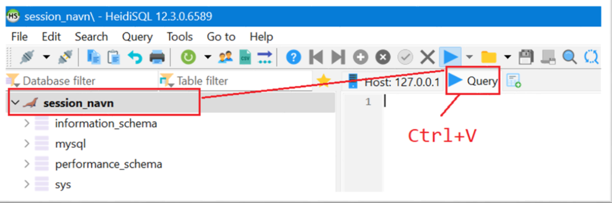
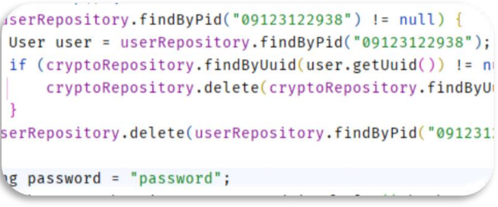
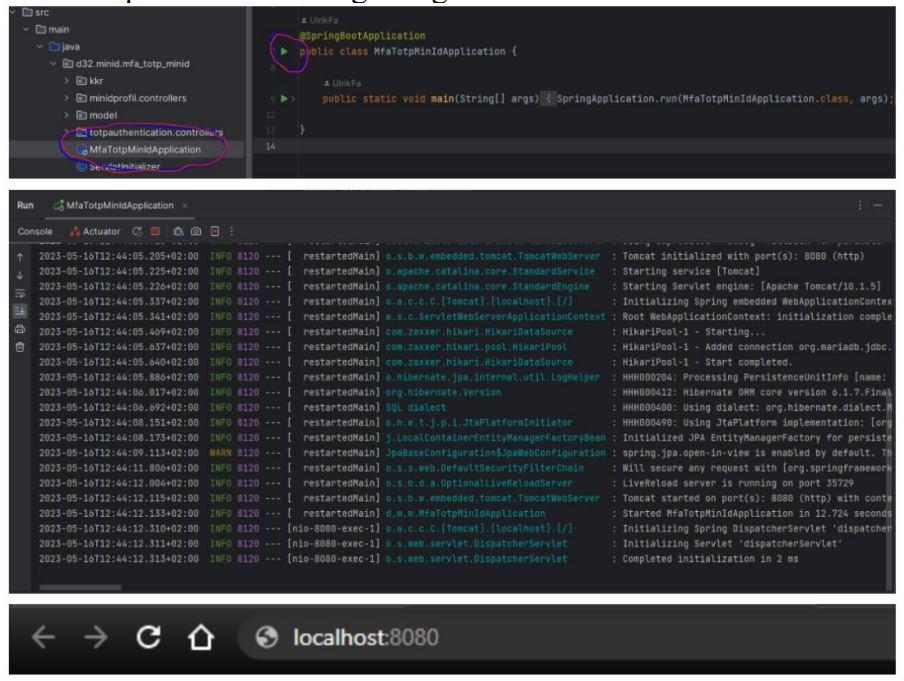

# MFA_TOTP_MinID
MinID Bachelor project repo

Det anbefales å bruke samme verktøy som prosjektgruppen selv har anvendt. Dette innebærer Intellij som IDE for front- og backend utviklingen, og HeidiSQL for arbeid opp imot database. Instruksene for installasjon og kjøring er skrevet med utgangspunkt i disse verktøyene og tar ikke høyde for uforutsette problemer med andre programvarer.

## Database oppsett

Oppsettet av en database gjøres her vha. av HeidiSQL og tar utgangspunkt i at MariaDB er installert og kjører.

* Kopier innholdet i SQL-scipt.txt og kjør en query med det ved å lime inn scriptet i Query-vinduet i HeidiSQL (Figur 12), 
* Trykk “Execute sql...” (Blå pil) eller press ned F9, scriptet vil kjøre og generere databasen.
* Det kan være behov for å gjøre en refresh for å se oppdateringene: Høyreklikk session_navn eller tilsvarende > og velg refresh. 

Dette skal opprette en database med navn minid, under her skal crypto, kodeliste, kodeverk, spring_session,  spring_session_attributes og user ligge.

Figur 1  Bilde av hvor script limes inn og kjøres

## Application.properties konfigurasjon

Med en database som er oppe og går, kan det nå kobles til i application.properties. Denne filen ligger i ``src/main/resources``

>spring.datasource.url=jdbc:mariadb://``ip-adresse``/``database navn``  
>spring.datasource.username=``database brukernavn``  
>spring.datasource.password=``database passord``  

>spring.security.oauth2.client.registration.idporten.client-id=``client id``  
>spring.security.oauth2.client.registration.idporten.client-secret=``client secret``  

Prosjektet nytter seg av en kobling opp imot DigDirs testsystem, dette krever client_id og client_secret tilsendt fra Digdir, og må legges til application.properties.

## Maven

I prosjektet ligger en pom.xml fil som er fylt inn med flere avhengigheter prosjektet vil ha til rammeverk og biblioteker. Maven skal håndtere dette automatisk

## Generer en bruker

En av testene i prosjektet; ``TestUserRepository`` genererer en bruker i databasen om den ikke eksisterer der fra før (Figur 2).  
Denne brukerkontoen vil kunne la seg nyttes til innlogging når programmet kjører, så det anbefales å kjøre gjennom testsettet før resten av programmet.  
Kjøring av testsettet vil også validere at maven har håndtert avhengigheter, og validere databasetilkobling.

Figur 2 Brukergenerering via testklasse

## Kjøring

Programmet kjøres ved å navigere til MfaTotpMinIdApplication.java og trykke pil markert (Figur 3).  
Terminalen vil da åpnes og vil indikere at programmet kjøres. Bruker må deretter åpne en nettleser og navigere til localhost:8080.
  
Figur 3 Kjøring av programmet 

 

 

 
